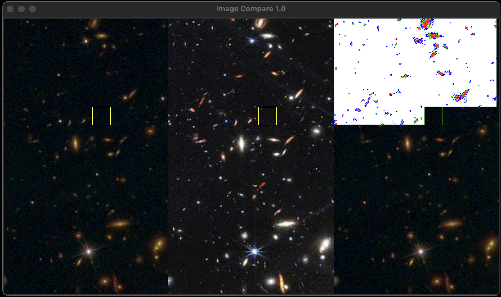

# Hubble Telescope vs. James Webb Telescope Image Comparison

This project focuses on comparing images captured by the Hubble Telescope and the James Webb Telescope and generating a differences map that highlights the disparities between the two images. The difference map will be color-coded, with red indicating significant differences, green representing moderate differences, blue representing small differences, and white representing no differences.

## Overview

This project aims to detect variations between two astronomical images taken from different telescopes and visualize these discrepancies in a clear and informative manner. We use the MIPS assembly language to implement the image comparison algorithm, specifically the "Sum of Absolute Differences" (SAD) method to achieve this. The images are stored as text files, with each pixel represented by an RGB value.

## Algorithm: Sum of Absolute Differences (SAD)

The SAD algorithm is a widely-used technique for comparing images. It works by calculating the absolute differences between corresponding pixels in the two images and then summing these differences to get an overall dissimilarity score. Lower SAD values indicate a higher degree of similarity between the images.

## Color Legend for the Difference Map

- Red: Significant differences between Hubble and James Webb Telescope images.
- Green: Moderate differences between the images.
- Blue: Small differences between the images.
- White: No differences between the images.

## Example Difference Map

Here is an example of what the generated difference map might look like:

In this example, the red areas indicate substantial variations between the Hubble and James Webb Telescope images, while the green, blue, and white areas signify moderate differences, small differences, and no differences, respectively. It is rendered by 32x32 pixels per chunk.

## Images Used in the Comparison

For the purpose of this project, we have selected two astronomical images taken from the Hubble Telescope and the James Webb Telescope. The images are provided in the "TestFiles" folder:

- `Tile_005_360.txt`
- `Tile_116_559.txt`

## Additional Notes

- This is one of the homework I did for GT ECE 2035. 

For any inquiries or feedback related to this project, please contact me.

---
Please note that the images used in this example are for illustration purposes only and do not represent actual data from the Hubble Telescope or the James Webb Telescope. I hold no rights to these images.
